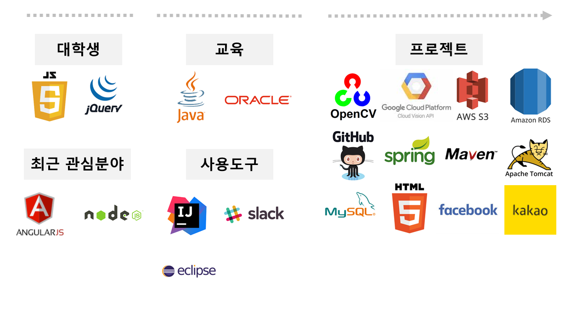

## 정원준 신입 개발자

 

## 보유기술
| 구분 | 보유기술 |
| ----- | ----- |
| Programing Language | Java, JS, HTML5, CSS, JQuery |
| Framework / Library | Spring(3~4), CSS Framework, Kakao, Daum Maps, GoogleVision, OpenCV |
| Server | MySQL, Oracle, Nodejs, tomcat, AWS EC2|
| Tool | Github, bash, maven, bower |

 

## 프로젝트 경력사항  

 

| 기간 | 프로젝트 |
| :----: | :----: |
| 2017.09.20 - 2017.10.04 (기간 중 10일) | [Today](https://youtu.be/w9TuLOraEW0) |
| 2017.03 - 2017.06 (3개월) | [Whame](https://youtu.be/eAeVGDenO10) |

 

## Project : [Today](https://github.com/nttejun/Today)
#### 개발 기간 : 2017.09.20 - 2017.10.04 (기간 중 10일) [(Demo Video)](https://youtu.be/w9TuLOraEW0)
#### 개발 인원 : 1명

| 구분 | 사용기술 |
| ----- | ----- |
| WebFrontend | JS, HTML5, CSS, jQuery |
| WebBackend | Java, Ajax |
| Database | MySQL |
| Framework / Library | AWS EC2, Bootstrap |
| Tool | bower |

 

### 프로젝트 목적
<h4>- 웹 애플리케이션 서버 작동원리 이해, 작동원리 과정 실습</h4>
완료 : 브라우저 요청을 처리하는 Servlet, MySQL 데이터베이스 연결 및 작업을 위한 JDBC 코드 구현
<h4>- 기본 기능 로그인, 글 등록, 댓글 추가 수정 삭제, 비동기 처리 구현</h4>
완료 : Ajax를 사용하여 로그인, 글 등록 비동기 처리
<h4>- 리눅스에 접속해서 EC2 인스턴스 IP 주소를 사용하여 프로젝트 접속 : 완료</h4>

 

## Project : [Whame](https://github.com/nttejun/WhameProject)
#### 개발 기간 : 2017.03 - 2017.06 (3개월) [(Demo Video)](https://youtu.be/eAeVGDenO10)
#### 개발 인원 : 4명

| 구분 | 사용기술 |
| ----- | ----- |
| WebFrontend | JS, HTML5, CSS, jQuery |
| WebBackend | Java, Ajax |
| Database | Oracle, MySQL, AWS S3, AWS RDS |
| Framework / Library | Spring, Daum Maps, KakaoAPI, AWS EC2, Materialize |
| Tool | Maven, Github |
| 내용 | 사용자가 음식점 **간판을 촬영하면 촬영한 이미지를 분석하여** 해당 음식점 메뉴 및 가격 정보 등을 손쉽게 제공하는 서비스입니다.  음식점 정보는 사용자가 찍은 음식점 간판을 **OpenCV API 와핑기법과 Canny를 사용하여 간판의 범위만을 추출합니다.** **GoogleVision을 이용하여** 추출한 사진에 있는 **텍스트를 분석하였습니다.** 최종 분석된 데이터는 DaumMap을 사용하여 사용자 반경 100m 내 데이터베이스에 저장된 음식점 정보를 제공하여 정확도를 향상시켰습니다.  웹, 모바일 웹 환경에서 사용이 가능하도록 반응형 웹으로 구현하였으며, **디자인 프레임워크 Materialize를** 사용하였습니다. 애플리케이션의 구조는 Spring MVC를 사용하였습니다.  사용자는 로그인 시 별도의 회원가입 없이 **Kakao, Facebook 계정 연동으로** 접속이 가능하도록 구현하였으며, 음식점 정보 및 위치를 카톡으로 **공유할 수 있는 링크기능을 구현하였습니다.**   사용자가 원하는 음식을 검색하면 주변 음식점 정보를 **Ajax를 사용하여 검색기능을 구현하였습니다.**   추가적으로 사이트 구현에 필요한 히스토리, 음식점 등록, 이벤트 처리, 쿠폰 및 일정 등 기본적인 서비스 기능을 구현하였습니다. |

 

### 본 프로젝트에서 담당한 역할

프로젝트 PM을 맡았습니다. 팀의 원활한 소통으로 업무 효율과 개발에 집중할 수 있는 개발환경을 만들기 위해 **협업과 버전관리에는 Github을** 사용하였습니다. 
프로젝트 서비스 구현은 사용자가 이미지를 촬영하면 간판 꼭지점 4개를 요청합니다. **네 점을 사용하여 wapping 기법으로 기울어진 이미지를 정방향 이미지로 변환을** 구현하였습니다. 
로그인 화면에서 **Kakao API를 사용한 계정연동을** 구현하였으며, 검색한 음식점을 클릭하면 해당 가게의 **위치 및 정보를 채팅방에 공유할 수 있는 링크기능을 구현하였습니다.**  
사용자가 메뉴를 검색하면 해당 음식점의 정보를 제공하는 **검색기능을 구현**하였으며, 기존 JSP 내 복잡한 자바 코드를 모두 제거하고, 페이지 이동없이 **검색결과를 빠르게 제공할 수 있도록 Ajax를 사용하였습니다**  
프로젝트를 하면서 **추후 코드 수정이 용이 하도록 객체는 하나의 기능만 처리할 수 있도록 구현하였으며 변수를 선언하면 이름으로 어떤 결과가 출력되는지 유추할 수 있도록 코드를 작성하는 노력을 하였습니다.**  
개발환경은 **Windows 10, Eclipse, Tomcat, Spring MVC, Maven 을** 사용하며 사용자의 **이미지를 저장하기 위한 AWS S3 스토리지** 서비스와 Oracle **항상 연결 가능한 환경을 위해 AWS RDS를 사용하였습니다.**  

---
 

### 자기소개서

Java, Javascript, HTML5, CSS로 1년의 개발 경력을 쌓은 개발자입니다. 항상 새로운 기술에 대한 호기심으로 배우려고 노력하며, 가독성 좋은 코드로 개발하는 개발자가 되기 위해 노력하고 있습니다. 

컴퓨터 학과에 진학하여 전과 후 다시 컴퓨터 공학을 공부하게 되었습니다 
전과를 하며 개발자로써 학부생과의 공부 기간은 조금 다를 수 있다고 생각합니다 

다만 저에게 상경계는 소통의 중요함을 경험할 수 있는 시간이 되었고, 함께 협업하는 지금의 개발환경에서도 저의 강점이 되어 팀 프로젝트에서 팀장으로 정해진 기간 내 팀원들과 프로젝트를 성공적으로 진행하였습니다 

현재 협업 프로젝트는 Google Vision, OpenCV API를 사용한 이미지 분석 웹 서비스를 개발기간 3개월, 4명의 개발인원이 참여하여 진행하였습니다 

협업에는 Github을 사용하였습니다. 코드 관리와 진행상황 파악에 어려움을 느꼈고, Github 공간에 최신 버전을 공유하며 문제를 보완하였습니다. 무엇보다 Github을 사용하며 개발에만 집중하는 환경을 구축하는데 개발도구의 역할 및 중요성을 깨닫게 되었습니다. 

Kakao, Daum, 이미지 분석 등의 API를 사용하였습니다. 위치기반, 링크공유, 계정연동 등 사용자 편의를 위한 목적으로 API를 적용하였습니다. 

이미지 파일 관리를 위해 AWS S3를 사용하였습니다. 

반응형 웹을 적용했습니다. 디자인 프레임워크 Materialize를 기반으로 웹과 모바일 웹 화면을 반응형 웹으로 구현했습니다. 

개인 프로젝트는 현재 진행중이며 유투브 동영상 다운로드 어플리케이션을 만들고 있습니다. Node.js를 사용하며 웹 크롤링을 이용한 동영상 고유 ID값을 얻어 동영상을 다운 받는 서비스를 혼자 개발 중에 있습니다. 

---
 

### 도전과 한계

4 학년 여름방학에 코딩을 다시 공부한다는 것은 저에게는 큰 도전이었습니다. 활동했던 대외활동을 모두 정리하면서 혼자 코딩 공부를 시작하였고 직접 작성한 코드가 브라우저에 출력되고 동작하는 모습을 처음으로 확인하면서 1학년 때 C언어나 컴퓨터 개론을 배우던 때와는 다르게 제가 생각하는 모습이 웹 화면에 출력되는 것이 신기하고 흥미로웠습니다. 가장 익숙했던 로그인을 만들고 싶어 처음 시작은 자바스크립트 서적을 독학하며 프로그래밍 공부를 시작하였습니다.  

자바스크립트 이벤트 처리를 통해 웹 화면을 그림판처럼 마음대로 사용하는 것이 재미는 있었지만 만족할 수 없었습니다. 웹 페이지를 직접 만들고 싶었고 부족한 기초를 채우며 무엇을 공부해야 하는지 스스로 방향을 잡을 수 있는 단계로 성장하기를 원했습니다. 방법을 찾기 시작하였고 비트교육센터 웹 표준/프레임워크 6 개월 과정을 수료하게 되었습니다.  

교육과정 앞선 3 개월은 기초 지식을 습득하고 기본 기능은 코드로 구현하면서 코드가 어떻게 작동하는지 공부 할 수 있었습니다. 남은 3 개월은 협업 프로젝트를 진행하며 처음 교육과정 등록 시 직접 회원가입 페이지를 구현하는 정도의 기대를 넘어 직접 검색 기능 페이지를 만들고 OpenAPI 를 사용하며 이미지 분석 서비스를 결과물로 완성했을 때의 희열은 앞으로 개발을 하며 많은 문제점과 부딪칠 때 처음 서비스 개발을 하면서 결국 한계를 극복해냈던 것처럼 똑같이 극복해낼 수 있다고 믿으며, 다음 단계로 성장할 수 있는 힘이 되어줄 것이라고 확신을 가질 수 있는 소중한 경험이 되었습니다.  

앞으로 개발자의 길을 걸으며 정해진 교육과정이나 커리큘럼 같은 지침서는 없습니다. 하지만 무엇이 부족한지 스스로 인지하고, 경계하며 무엇을 공부해야 제가 목표한 좋은 개발자가 될 수 있는지 스스로 방향을 잡고 능동적으로 준비할 수 있는 단계라고 생각합니다. 그리고 이제는 개발을 직업으로 제가 담당한 개발에 끝까지 책임을 다하여 서비스를 담당하기 위해 실무에 도전하는 신입 개발자입니다.  

---
 

### 장점 및 단점

저의 장점은 소통입니다. 상경계에서 10 여개의 프로젝트를 진행하면서 100 여명 이상의 사람들과 함께 프로젝트를 진행하였습니다. 프로젝트를 진행하면서 팀이 공통된 목표를 달성하기 위해 가 장 중요한 요소는 소통이라고 생각합니다. 업무 진행상황이나 변화는 팀원 모두가 공유하고 있어 야 하며 이런 환경을 가능하게 하기 위해 기본적으로 일상에서도 원활한 소통이 이루어지도록 누 구보다 팀원에게 관심을 갖고 먼저 다가가며 서로 간의 신뢰를 쌓았습니다. 한 사람의 업무 효율 이 전체 프로젝트 진행에 큰 영향을 미치는 지금의 개발 환경에서는 더욱 중요하다고 생각합니다. 이번 협업 프로젝트에서 팀원 간 원활한 소통으로 프로젝트 진행상항을 함께 공유하고 의논사항 은 개선하며 나머지 시간은 개발에 집중할 수 있는 개발환경을 구축하였습니다. 팀원들 간의 원 활한 소통으로 프로젝트를 안정적으로 진행하는데 기여했다고 생각되어 저의 장점을 소통이라고 생각하였습니다.  

저의 단점은 조급함 입니다. 제가 목표하는 지점에 도달하기 위해 요구되는 부분은 많지만 시간 은 하루에 24 시간으로 한정되어 있는 상황에서 빠르게 목표를 달성하거나, 달성해야 할 것 같은 조급함을 갖고 있습니다. 이 점은 목표를 이루기 위해 필요한 것을 무리해서 동시에 진행하거나 현재 감당할 수 있는 것 이상으로 실행하면서 과부하가 발생하는 경우도 한번씩 있었습니다. 아직도 조급함은 있지만 이 점을 보완하기 위해 중요한 일과 급하게 처리해야하는 일을 구분하고 월간, 일간으로 실행할 액션플랜을 세워 계획된 일정에 맞게 목표를 달성해 나가고 있습니다. 이 러한 노력으로 지금은 개발자로써 목표한 것을 이뤄 나가는 것과 함께 인생을 계획하고 준비하는 데 있어서도 장기적인 시점으로 안정적으로 준비할 수 있는 계기가 되었다고 생각합니다.

---

 

### 개발자 삶을 선택

개발자의 길을 선택하고 제 적성과 가장 알맞다고 느낀 부분은 공부를 할수록 새로운 분야가 더 많아진다는 것입니다. 배우고 싶은 새로운 지식과 기술을 선택하여 주도적으로 학습할 수 있는 선택권이 스스로에게 주어지며 개발은 배운 것을 적용하여 결과를 직접 확인할 수 있다는 것이 다른 학문과는 구별되면서 제가 개발에 흥미를 가질 수 있었던 중요한 요소라고 생각합니다.  

최근에는 코드를 구현하면서 사용한 개념들을 다시 공부하면서 느끼는 것이 하나 있습니다. 같은 내용이지만 깊이 있는 공부를 하면서 같은 내용에서도 새로움을 느낄 수 있었습니다. 개발은 정 해진 답을 찾는 것이 아닌 정답이 없는 새로운 문제를 가장 효율적인 방법으로 매번 해결하기 위 해 스스로 학습하게 되는 순환적 구조가 제가 가장 공부를 즐겁게 할 수 있도록 동기부여도 제공 하는 환경이며 무엇보다 내가 열심히 시간을 투자한 만큼 그것이 결과로 나타나고 인정받을 수 있다는 것이 개발의 가장 큰 매력이라고 느끼면서 개발자의 삶을 선택하게 되었습니다.  

개발자의 삶을 걸어가며 3 년, 5 년 뒤는 제가 목표한 좋은 개발자가 되는 초석을 다져 제가 작성 한 코드가 다른 사람들에게 구현 시 도움이 될 수 있도록 또는 올바른 코드를 작성하는 방법을 주변에 지식을 공유할 수 있는 단계의 개발자가 되는 것을 목표로 꾸준히 노력하고 있는 개발자 입니다.

---

### Profile

**Wonjun Jeong Site**  
Link : [Github (http://github.com/nttejun)](https://github.com/nttejun/nttejun.github.io/tree/master/portfolio) 
Link : [Blog (http://wjun.tistory.com/)](http://wjun.tistory.com/) 
Link : [Facebook (https://www.facebook.com/nttejun)](https://www.facebook.com/nttejun)  
Email : nttejun@gmail.com 
phone : 010-5516-4192 

 

| 기간 | 이력 |
| :----: | :----: |
| 2017.01 - 2017.06  |  비트교육센터 웹 표준/프레임워크 과정 (수료) |
| 2011.03 - 2018.02  |  순천향대학교 국제통상학과 (2018년 02월 졸업예정) |
