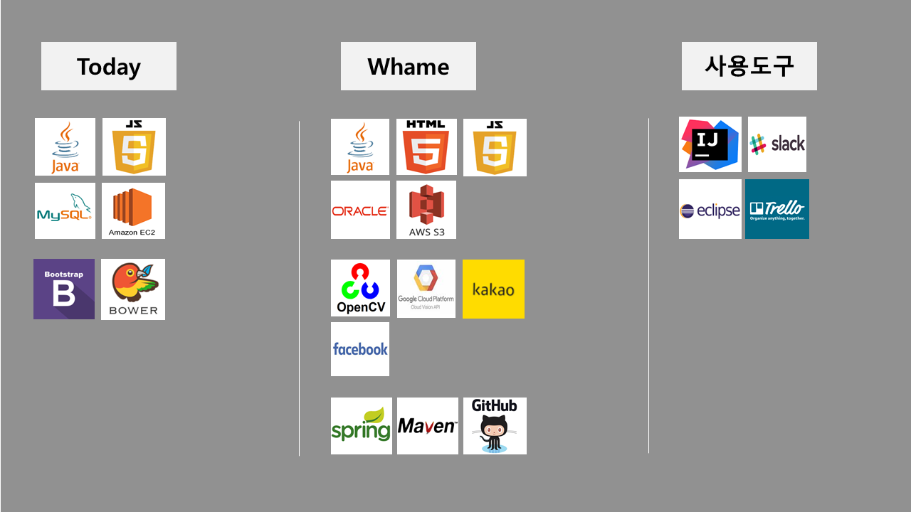

## 정원준 신입 개발자

**Wonjun Jeong Site**  
Link : [Github (http://github.com/nttejun)](https://github.com/nttejun/nttejun.github.io/tree/master/portfolio) 
Link : [Blog (http://wjun.tistory.com/)](http://wjun.tistory.com/) 
Link : [Facebook (https://www.facebook.com/nttejun)](https://www.facebook.com/nttejun)  
Email : nttejun@gmail.com 
phone : 010-5516-4192 

 

---
 

#### 프로젝트 경력사항  
| 프로젝트명 | Whame(이미지 분석을 이용한 데이터 제공 웹 서비스) |
| :-----: | ----- |
| 개발환경 | Chrome59, Window10, Eclipse, SpringMVC, Maven, Tomcat |
| 사용 DB | OracleDB, MySQL, AWS S3, AWS RDS |
| Lang/Tools | Github, Javascript, HTML5, CSS, Java, Ajax |
| 사용기술 | OpenCV, GoogleVision, Kakao, Facebook, Daum API |
| 프로젝트 소개 | 인터넷 상에 음식점에 대한 수많은 메뉴와 후기 정보가 존재하고 있어 사용자는 얻고자 하는 정보를 찾는데 어려움이 있었습니다.  Whame 서비스는 사용자가 음식점 **간판을 촬영하면 촬영한 이미지를 분석하여** 해당 음식점 메뉴 및 가격 정보 등을 손쉽게 제공하는 서비스입니다.  정확한 음식점 메뉴 및 정보 데이터를 제공하기 위해 API를 사용하였습니다. 사용자가 찍은 음식점 간판 사진을 **OpenCV 와핑기법과 Canny를 사용하여 간판의 범위만을 추출하였습니다.** **GoogleVision을 이용하여** 가공된 사진에 있는 **텍스트와 컬러 데이터를 분석하였습니다.** 최종적으로 분석한 데이터를 Daum지도를 사용하여 실시간으로 사용자 반경 100m 범위 내에데이터베이스에 저장된 음식점 정보와 매칭되는 결과를 찾아 정보를 제공하여 정확도를 향상시켰습니다.  Whame 서비스는 웹, 모바일 웹 환경에서 원활한 사용이 가능하도록 반응형 웹으로 구현하였으며, **디자인 프레임워크로 Materialize를** 사용하였습니다. 어플리케이션의 전체구조는 Spring MVC프레임워크를 사용하여 구현하였습니다.  사용자는 로그인 시 별도의 회원가입 없이 **Kakao, Facebook 계정 연동으로** 접속이 가능하도록 구현하였으며, 음식점에 대한 정보 및 위치를 카톡으로 **서로 공유할 수 있는 링크기능을 구현하였습니다.**   사용자가 원하는 음식을 검색하면 주변에 있는 해당되는 음식점 정보를 제공하도록 **Ajax를 사용하여 비동기처리로 검색기능을 구현하였습니다.**   추가적으로 사이트 구현에 필요한 히스토리, 음식점 등록, 이벤트 처리, 쿠폰 및 일정 기능과 같이 구현에 필요한 기본적인 요소를 구현하였습니다. |

 

#### 본 프로젝트에서 담당한 역할

Whame 프로젝트에서 저는 팀장으로 팀원들 간의 원활한 소통으로 업무 효율과 개발에 집중할 수 있는 개발환경을 만들기 위해 **협업과 버전관리에는 Github을** 사용하였습니다. 프로젝트 기능 구현에서 **사용자가 촬영한 이미지에 4개의 간판 꼭지점을 찍으면 해당 점을 기준으로 각도가 기울어진 간판 이미지를 wapping 기법을 사용하여 정상각도로 이미지 변환을** 구현하였습니다.
로그인 화면에 **Kakao API를 사용하여 계정연동** 시 프로필 이미지를 사용하였으며, 음식점을 검색하여 음식점 클릭 시 해당 가게의 **위치 및 정보를 대화창에 공유할 수 있는 링크기능을 구현하였습니다.**  
사용자가 메뉴를 검색하면 해당되는 음식점 정보를 제공하는 검색기능을 구현하였으며, jsp파일 내 자바 코드를 사용하지 않으면서 페이지 이동없이 **빠르게 검색결과를 제공할 수 있는 비동기 Ajax 통신을 사용하였습니다**  
프로젝트를 하면서 **추후에 코드 수정이 용이 하도록 만들기 위해 객체는 하나의 기능만 처리할 수 있도록 구현하였으며 변수를 선언하면 이름만으로 어떤 결과를 얻을 수 있는지 유추할 수 있도록 코드를 작성하기 위해 노력하였습니다.**  
개발환경은 **Windows 10에서 eclipse, tomcat, spring MVC, maven 을** 사용하며 사용자의 **이미지를 저장하기 위한 Amazon S3 스토리지** 서비스와 오라클DB와 **항상 연결 가능한 환경을 위해 Amazon RDS를 사용하였습니다.**  

---
 

| 기간 | 프로젝트 |
| :----: | :----: |
| 2017.06 - 2017.07 | Youtube Download 프로젝트 (진행중) |
| 2017.03 - 2017.06 | 이미지분석 프로젝트 (진행완료) [(데모영상)](https://youtu.be/eAeVGDenO10) |

| 기간 | 이력 |
| :----: | :----: |
| 2017.01 - 2017.06  |  비트교육센터 웹 표준/프레임워크 과정 (수료) |
| 2011.03 - 2018.02  |  순천향대학교 국제통상학과 (2018년 02월 졸업예정) |

---
 

### 자기소개서

Java, Javascript, HTML5, CSS로 1년의 개발 경력을 쌓은 개발자입니다. 항상 새로운 기술에 대한 호기심으로 배우려고 노력하며, 가독성 좋은 코드로 개발하는 개발자가 되기 위해 노력하고 있습니다. 

컴퓨터 학과에 진학하여 전과 후 다시 컴퓨터 공학을 공부하게 되었습니다 
전과를 하며 개발자로써 학부생과의 공부 기간은 조금 다를 수 있다고 생각합니다 

다만 저에게 상경계는 소통의 중요함을 경험할 수 있는 시간이 되었고, 함께 협업하는 지금의 개발환경에서도 저의 강점이 되어 팀 프로젝트에서 팀장으로 정해진 기간 내 팀원들과 프로젝트를 성공적으로 진행하였습니다 

현재 협업 프로젝트는 Google Vision, OpenCV API를 사용한 이미지 분석 웹 서비스를 개발기간 3개월, 4명의 개발인원이 참여하여 진행하였습니다 

협업에는 Github을 사용하였습니다. 코드 관리와 진행상황 파악에 어려움을 느꼈고, Github 공간에 최신 버전을 공유하며 문제를 보완하였습니다. 무엇보다 Github을 사용하며 개발에만 집중하는 환경을 구축하는데 개발도구의 역할 및 중요성을 깨닫게 되었습니다. 

Kakao, Daum, 이미지 분석 등의 API를 사용하였습니다. 위치기반, 링크공유, 계정연동 등 사용자 편의를 위한 목적으로 API를 적용하였습니다. 

이미지 파일 관리를 위해 AWS S3를 사용하였습니다. 

반응형 웹을 적용했습니다. 디자인 프레임워크 Materialize를 기반으로 웹과 모바일 웹 화면을 반응형 웹으로 구현했습니다. 

개인 프로젝트는 현재 진행중이며 유투브 동영상 다운로드 어플리케이션을 만들고 있습니다. Node.js를 사용하며 웹 크롤링을 이용한 동영상 고유 ID값을 얻어 동영상을 다운 받는 서비스를 혼자 개발 중에 있습니다. 

---
 

### 도전과 한계

4학년 여름방학에 코딩을 다시 공부한다는 것은 저에게는 큰 도전이었습니다. 활동했던 대외활동을 모두 정리하면서 혼자 코딩 공부를 시작하였고 직접 작성한 코드가 브라우저에 출력되고 동작하는 모습을 처음으로 확인하면서 1학년 때 프로그래밍을 배우며 느꼈던 것 과는 다르게 다른 이벤트 처리를 구현해서 다른 결과도 출력하고 싶다는 생각이 들었습니다. 그래서 처음에는 자바스크립트 서적을 독학하며 본격적으로 프로그래밍을 공부하기로 결심하게 되었습니다.   
웹에서 데이터를 주고 받으며 동작하는 기능을 구현하고 싶던 저는 자바스크립트 만으로는 한계를 느꼈습니다. 원하는 어플리케이션을 만들기 위해 작동원리와 구현에 필요한 기술은 무엇이 있고, 어떤 것을 공부해야 하는지 알고 싶어 비트교육센터 웹 표준/프레임워크 6개월 과정을 수료하게 되었습니다.   
앞선 3개월의 시간은 필요한 지식과 코딩 연습을 할 수 있는 시간이 되었습니다. 이후 프로젝트 3개월의 시간은 제가 만들고 싶었던 기능과 처음 접하는 기술을 사용하여 실제 작동 되도록 구현하였습니다. 저에게는 수료를 떠나 어플리케이션을 개발하는 과정이 너무 재미있었고 6개월의 시간이 배움으로 가득해 정말 짧은 시간으로 느껴진 시간이었습니다.   
이제는 회사에서 사용하는 새로운 업무환경과 팀에 잘 적응할 수 있는 신입 개발자로서 첫 걸음에 도전하고자 합니다.  

---
 

### 장점 및 단점

저의 장점은 소통입니다. 상경계에서 10여개의 프로젝트를 진행하면서 100여명 이상의 사람들과 함께 프로젝트를 진행하였습니다. 팀이 공통된 목표를 달성하기 위해 가장 중요한 요소 중 하나는 소통이었습니다. 한 사람의 업무 효율이 전체 프로젝트 진행에 큰 영향을 미치는 지금의 개발 환경에서는 더욱 중요하다고 생각됩니다. 이번 협업 프로젝트에서도 팀원 간 원활한 소통으로 프로젝트 진행사항과 의논방안 및 업무를 함께 공유하며 나머지 시간은 개발에 집중할 수 있는 개발환경을 구축할 수 있도록 노력하여 프로젝트를 성공적으로 진행하였습니다.   
저의 단점은 조급함 입니다. 저의 부족한 부분을 알기 때문에 무의미하게 시간을 보내는 것에 조급해 하며 주말에는 놀거나 쉬지 않고 스터디나 카페, 서점에 가서 새로운 것에 대한 배움이나 공부를 하도록 저 스스로를 다그치는 경우가 많습니다. 물론 이러한 조급함이 주말에도 카페에서 자연스레 코딩하는 제 습관을 만들어 주어 개발자로서 부족한 기량을 채워가는데 긍정적인 영향을 주었다고 생각합니다.  

---
 

### 개발자 삶을 선택

개발자의 길을 선택하고 제 적성과 가장 알맞다고 느낀 부분은 공부를 할수록 공부할 내용이 더 많아진다는 것입니다. 그만큼 배우고 싶은 새로운 지식과 기술을 선택하여 주도적으로 학습할 수 있으며 배운 것은 실제로 적용하여 결과로 확인할 수 있다는 것이 다른 학문과는 구별되면서 제가 개발에 흥미를 가질 수 있었던 중요한 요소라고 생각합니다.   
한번 배웠던 자바에 대한 기본 지식을 깊이 있게 다시 공부하면서 매일 사용하던 기능도 사용의 의미를 정확히 알고 새로운 방법으로 활용할 수 있는 것을 깨닫게 되면서 공부에 대한 즐거움과 매일 사용하던 단어도 새로운 단어처럼 느낄 수 있다는 것이 프로그래밍의 매력이라고 생각되며 이러한 깨달음의 과정 속에서 개발자의 평생공부를 나도 즐겁게 할 수 있겠다는 확신을 갖게 해주었습니다.  

---
